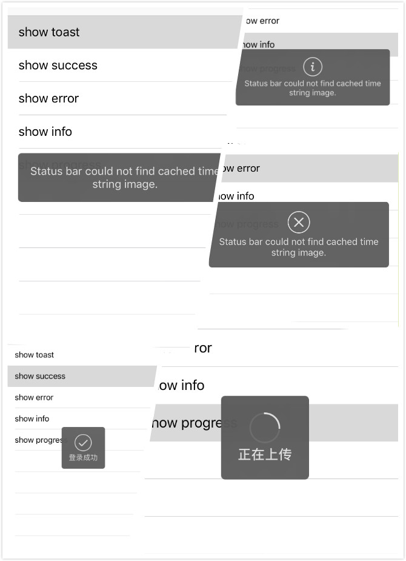

# ToastKit
最近对公司的项目进行重构，将MBProgressHUD进行swift封装。ToastKit是动态库项目，方便以后下次直接使用。

> 封装原理：定义Toastable协议，并且在extension中实现相关的方法。
> 
> 拓展UIResponder并且实现Toastable，UIView、UIViewController、UIWindow等对象可以直接使用Toastable方法。

## 使用方法

```

    override func tableView(_ tableView: UITableView, didSelectRowAt indexPath: IndexPath) {
        
        switch indexPath.row {
        case 0:
            showToast("Status bar could not find cached time string image.")
        case 1:
            showToast("登录成功", status: .success)
        case 2:
            showToast("Status bar could not find cached time string image.", status: .error)
        case 3:
            showToast("Status bar could not find cached time string image.", status: .info)
        case 4:

            let toast = showProgress(0.0, text: "正在上传")
            var progress:Float = 0.0

            Timer.scheduledTimer(withTimeInterval: 1, repeats: true) { (timer) in
                progress = progress + 0.05
                toast.progress = progress
                if progress >= 1.0 {
                    timer.invalidate()
                    self.hideToast()
                }
            }
            
            toast.completionBlock = {
                print("Toast did dismiss!!!")
            }
            
        default:
            break
        }
    }

```

## 效果图


